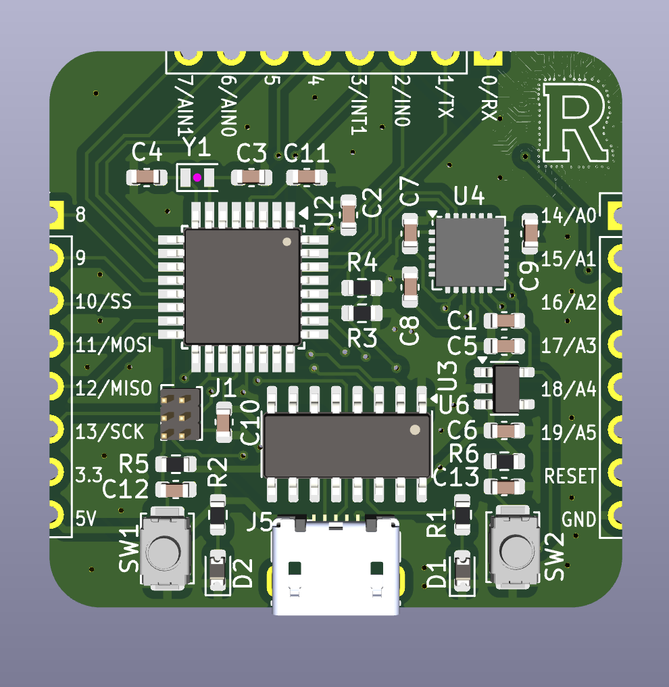

# ATmega88PA Sensor Interface Board

This project is a compact microcontroller development board based on the **ATmega88PA**, equipped with an **MPU-6050** accelerometer/gyroscope and USB interface. It is designed for embedded systems development, particularly in motion-sensing or robotics applications.

## Features

- **Microcontroller**: ATmega88PA (TQFP32)
- **IMU Sensor**: MPU-6050 (3-axis gyroscope + 3-axis accelerometer)
- **USB Interface**: CH340C USB-to-Serial converter
- **Onboard Voltage Regulation**: 5V to 3.3V via AP2112K-3.3
- **USB Power and Data via Micro-USB**
- **External Programming Header (ISP)**
- **I2C and UART breakout pins**
- **Reset and User Button**
- **LED Indicators**: Power and status/debug
- **Crystal Oscillator**: 8 MHz external crystal
- **Compact, breadboard-friendly form factor**

---

## Schematic Overview

- **Power Supply**:
  - Micro-USB supplies +5V.
  - LDO (AP2112K-3.3) regulates down to +3.3V for MPU-6050 and I/O.
- **Microcontroller (U2)**: ATmega88PA is the central controller.
  - Interfaces: I2C (SCL/SDA), UART (TX/RX), and SPI (MISO/MOSI/SCK)
  - Reset circuitry via pushbutton and capacitor.
- **MPU-6050 (U4)**: Connected via I2C with 4.7kΩ pull-ups.
- **USB to Serial (U3 - CH340C)**:
  - Used for serial communication and programming via UART.
- **ISP Header (J1)**: For initial bootloader flashing or full firmware flashing.

---

## PCB Details

- **2-layer PCB** with top and bottom copper planes.
- Carefully routed signal traces with decoupling capacitors close to ICs.
- Exposed pads for easy pin access to GPIOs.
- Mounting holes and labeled pin headers.
- Silkscreen labeling of pin functions for ease of use.
- 3D Render available for visualization and placement inspection.

---

## Pinout Summary

| Pin | Function       | Notes                      |
|-----|----------------|----------------------------|
| PB0–PB7 | GPIO / UART / SPI | Digital I/O and communication |
| PC0–PC5 | GPIO / I2C        | Includes SDA/SCL for MPU6050 |
| PD0–PD7 | GPIO / UART       | TX/RX, user-defined GPIO      |
| SW1     | Reset Button      | Pull-down with 10kΩ resistor |
| SW2     | User Button       | Connected to PB0              |
| J1      | ISP Header        | MISO/MOSI/SCK/RESET          |

---

## Getting Started

### 1. Flashing Firmware

- **Via ISP (J1)**: Use AVR ISP programmer.
- **Via UART (CH340C)**: Use bootloader (if pre-installed).

### 2. Power Supply

- Plug in via **Micro-USB**.
- Onboard LDO provides 3.3V logic supply.

### 3. I2C Communication

- MPU-6050 is accessible at default I2C address `0x68`.
- Ensure pull-ups (R3, R4 = 4.7kΩ) are present on SDA/SCL lines.

---

## Tools Used

- **Schematic & PCB Design**: [KiCad EDA](https://kicad.org)
- **Microcontroller Programming**: `avrdude`, `Arduino as ISP`, PlatformIO
- **Firmware Development**: C/C++ (AVR-GCC or Arduino IDE)

---

## License

Open-source hardware. You may use, modify, and distribute under the terms of the  MIT license.
